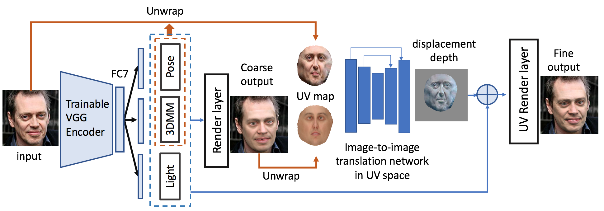
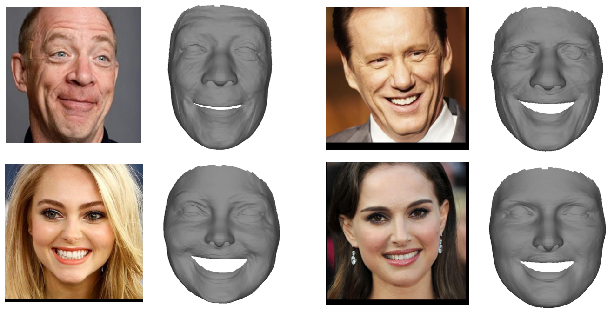

# unsupervised-detail-layer
Code repository for paper "Self-supervised Learning of Detailed 3D Face Reconstruction (TIP2020)"

<div>

</div>

<div>

</div>


## Prerequisite

- python 3.7
- tensorflow 1.15
- g++ 4.8 (other version might also work)
- [tf_mesh_renderer](https://github.com/google/tf_mesh_renderer)

Please read **install.sh** for more details. It installs all packages required to run the codes, and compiles the c++ kernel of the differentiable renderer.
Pay attention to finding the correct path to **TF_INC** and **TF_LIB**. The path specified in **install.sh** might not suit your case. If it does not work, please try to find them manually.
You can also compile the codes using methods provided by [**tf_mesh_renderer**]().

## Files

We release the checkpoint files, resources, and some testing results for our model.
As the training tfrecords are huge, we only provide one tfrecord for testing our codes.
We will release the url in **baidu drive** in some days.

[**google drive**](https://drive.google.com/drive/folders/1fTyRPmb5NO57UycoRum9EU8tc2oLJORX?usp=sharing)


- Please download the training data **train_data.zip** into the repo root directory **./** and unzip them.
- Please download the checkpoints **ckptxxx.zip** into **./results/** and unzip them.
- Please download the **resources.zip** into the repo root directory **./** and unzip it.
- Please download the **frozen_models.zip** into **./preprocess/** and unzip it. They are face detection and landmark detection models used in proprocessing a face image.

## Running

- In **run_train.sh**, we provide commands for training the coarse / fine model.
- In **run_test.sh**, we provide commands for inference. Note that the **batch_size** should be 1.

## Citation

If you use the codes provided here in your paper, please cite the following.

```
@article{chen2019self,
  title={Self-supervised learning of detailed 3d face reconstruction},
  author={Chen, Yajing and Wu, Fanzi and Wang, Zeyu and Song, Yibing and Ling, Yonggen and Bao, Linchao},
  journal={arXiv preprint arXiv:1910.11791},
  year={2019}
}
```

## Acknowledgement

Our codes use the differentiable renderer and vggface backbone provided in the following two repos. We thank them for providing the codes.

- **tf_mesh_renderer**: [https://github.com/google/tf_mesh_renderer](https://github.com/google/tf_mesh_renderer)
- **vgg face**: [https://github.com/ZZUTK/Tensorflow-VGG-face](https://github.com/ZZUTK/Tensorflow-VGG-face)

## Contact

If you have any questions regarding this work, please send emails to **jadechancyj907@gmail.com**.

## License

```
MIT License

Copyright (c) [2020] [Yajing Chen]

Permission is hereby granted, free of charge, to any person obtaining a copy
of this software and associated documentation files (the "Software"), to deal
in the Software without restriction, including without limitation the rights
to use, copy, modify, merge, publish, distribute, sublicense, and/or sell
copies of the Software, and to permit persons to whom the Software is
furnished to do so, subject to the following conditions:

The above copyright notice and this permission notice shall be included in all
copies or substantial portions of the Software.

THE SOFTWARE IS PROVIDED "AS IS", WITHOUT WARRANTY OF ANY KIND, EXPRESS OR
IMPLIED, INCLUDING BUT NOT LIMITED TO THE WARRANTIES OF MERCHANTABILITY,
FITNESS FOR A PARTICULAR PURPOSE AND NONINFRINGEMENT. IN NO EVENT SHALL THE
AUTHORS OR COPYRIGHT HOLDERS BE LIABLE FOR ANY CLAIM, DAMAGES OR OTHER
LIABILITY, WHETHER IN AN ACTION OF CONTRACT, TORT OR OTHERWISE, ARISING FROM,
OUT OF OR IN CONNECTION WITH THE SOFTWARE OR THE USE OR OTHER DEALINGS IN THE
SOFTWARE.
```